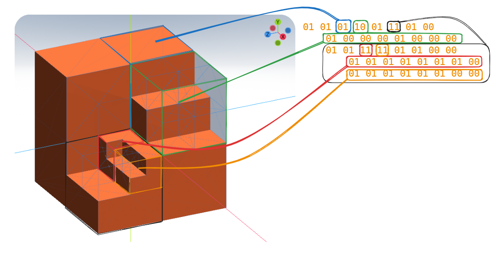

# Recursive Octree Notation (RON)

RON is a two-bit unsigned integer notation designed specifically for efficient streaming and rendering of large 3D models. By providing a recursive hierarchy of model detail, it enables users to control the level of detail received and rendered, based on the proximity of each part of the model.

## Definition
Each corner of an octree cube in 3D space is represented using a two-bit number with the below representations:

- 00b (0): The corner is free–defined as not being part of the 3D model.
- 01b (1): The corner is occupied–signifies the corner falling within the 3D model.
- 10b (2): The corner is mostly free–meaning more than 50% of the corner's area does not fall within the 3D model.
- 11b (3): The corner is mostly occupied or equally split–means more than 50% or exactly 50% of the corner is within the 3D model. 

The order of the two-bit numbers can be described in the following way. In a right-handed coordinate system (positive x-axis to the right, positive y-axis upwards, and the positive z-axis towards the viewer), the first number represents the corner by the origin, and the next number will represent the corner towards the x-axis. The third corner will be over the first corner towards the y-axis and the fourth will be over the second towards both x-axis and y-axis. Repeate this step in an extended z-axis. If you write the coordinates for each corner, it would look something like this depending on the scale and position of the octree:

    (0,0,0), (1,0,0), (0,1,0), (1,1,0), (0,0,1), (1,0,1), (0,1,1), (1,1,1)

Here, (1,1,1) corresponds to the last (8th) corner in the octree order positioned at x=1, y=1 and z=1.

## Recursion 
If a corner is in the 'mostly free' or 'mostly occupied or equally split' state, it's defined as an octree cube itself. Its eight corners are then represented by additional two-bit numbers, each appended to the end of the original octree string in the same order. When we encounter multiple corners in this state, each one becomes its own sub-level in the sequence. If corners within these sub-levels are again 'mostly free' or 'mostly occupied', their respective descriptions are added sequentially after the description of the previous sub-level cube. This arrangement allows users to control the level of detail by simply choosing to discard the remainder of the data stream when sufficient detail has been achieved.

## Usage 
The RON approach is especially useful in efficiently streaming large 3D models. The compact nature of data transmission allows for faster rendering with optimal resource utilization. The initial 8x2 bits (that is, two bits for each of eight corners) provide a primary level of detail, representing the model or its far-off parts with just eight voxels to conserve bandwidth and processing power. If N octree corners are deemed to be 'mostly free' or 'mostly occupied', then the next N 8x2 bits of data would represent the next level of detail for those particular octree corner, and so on.

This specification yields optimal speed, detail, and efficiency when streaming and rendering 3D models, providing a scalable approach to handling 3D data in varying contexts.

## Practical Example

Let's consider a simple 3D cube model. Its octree representation could be as follows:

    01 01 01 10 01 11 01 00

This means that most of the corners are part of the 3D model (01 or 11). The fourth corner mostly do not fall within the model but have some part in it (10). The sixth corner is mostly part of the model, but has some parts that does not fall within the model. And the last corner do not fall within the model at all (00).

The third and sixth corner (10) has their own sub-level octree, they are represented as:

    01 00 00 00 01 00 00 00 01 01 11 11 01 01 00 00

A low-level version of our cube model now becomes:

    01 01 01 10 01 11 01 00 01 00 00 00 01 00 00 00 01 01 11 11 01 01 00 00

This recursive and compact representation enables efficient streaming and rendering of complex 3D models.

Lets format the data in a more human readable form by using new-line and tab to show where a new sub-levels starts

    01 01 01 10 01 11 01 00
        01 00 00 00 01 00 00 00
        01 01 11 11 01 01 00 00

Now we can start adding even more detail. You see the last sub-level octree has a sub-level on its third and fourth corner. Lets represent them as:

    01 01 01 01 01 01 01 00
    01 01 01 01 01 01 00 00

The whole model can now be written like this:

    01 01 01 10 01 11 01 00
        01 00 00 00 01 00 00 00
        01 01 11 11 01 01 00 00
            01 01 01 01 01 01 01 00
            01 01 01 01 01 01 00 00

or using unsigned integers (1-3):

    1112131010001000113311001111111011111100

or using 8-bit against the ASCII table:

    Vt@@_PUTUP
